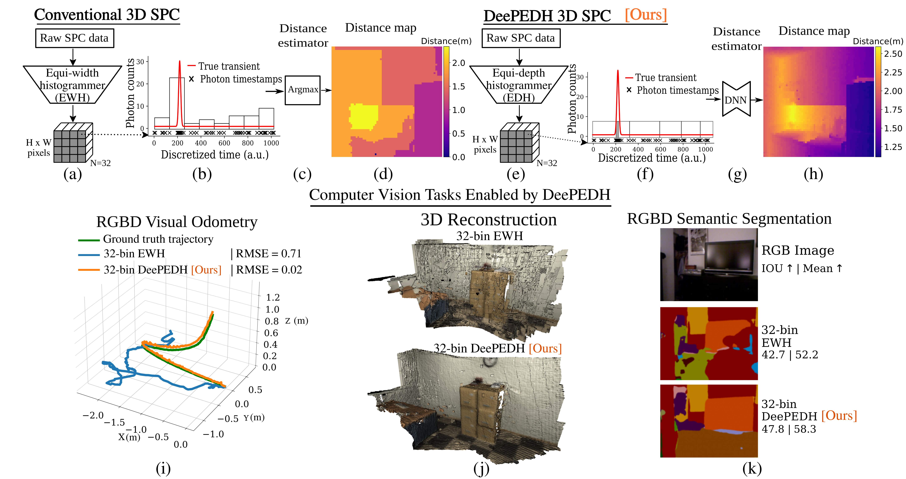

# [PEDH-ECCV2024](https://kaustubh-sadekar.github.io/PEDH-ECCV2024/)
Single-Photon 3D Imaging with Equi-Depth Photon Histograms


## Official project page: https://www.computational.camera/pedh 



**Our proposed DeePEDH pipeline enables SPCs to be used in resource-constrained applications.** SPCs generate large amounts of raw timestamp data, requiring high in-pixel memory and causing a data bottleneck. (a-d) Conventional 3D SPCs resort to low-resolution equi-width (EW) histograms resulting in poor distance resolution. (e-g) DeePEDH uses a more efficient on-sensor compression scheme through equi-depth (ED) histograms combined with a deep neural network distance map estimator. (h) The proposed method provides accurate high-resolution distance maps with 10 - 100x lower bandwidth. (i-k) DeePEDH paves the way for various computer vision tasks to be performed on resource-constrained devices using SPCs for 3D sensing.

## Citation

If you would like to cite us, kindly use the following BibTeX entry.

```
@misc{sadekar2024singlephoton3dimagingequidepth,
      title={Single-Photon 3D Imaging with Equi-Depth Photon Histograms}, 
      author={Kaustubh Sadekar and David Maier and Atul Ingle},
      year={2024},
      eprint={2408.16150},
      archivePrefix={arXiv},
      primaryClass={eess.IV},
      url={https://arxiv.org/abs/2408.16150}, 
}
```
